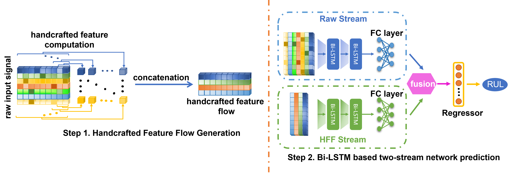

# Bi-LSTM based Two-Stream Network for Machine Remaining Useful Life Prediction
This repository is implemented by [Ruibing Jin](https://ruibing-jin.github.io/).


**Bi-LSTM based Two-Stream Network is proposed to predict the machine remaining useful life (RUL) and achiveves state-of-the-art performaces on the C-MAPSS benchmark.**

## Abstract

In industry, prognostic health management (PHM) is used to improve the system reliability and efficiency. In PHM, remaining useful life (RUL) prediction plays a key role in preventing machine failure and reducing operation cost. Recently, with the development of deep learning technology, the long short-term memory (LSTM) and convolutional neural networks (CNN) are adopted into many RUL prediction approaches, which show impressive performances. However, existing deep learning based methods directly utilize raw signals. Since noise widely exists in raw signals, the quality of these approaches' feature representation is degraded, which degenerates their RUL prediction accuracy. To address this issue, we firstly propose a series of new handcrafted feature flows (HFFs), which can suppress the raw signal noise, and thus improve the encoded sequential information for the RUL prediction. Additionally, to effectively integrate our proposed HFFs with the raw input signals, a novel Bi-LSTM based two-stream network is proposed. In this novel two-stream network, three different fusion methods are designed to 
investigate how to combine both streams' feature representations in a reasonable way. 
To verify our proposed Bi-LSTM based two-stream network, extensive experiments are carried out on the C-MAPSS dataset, showing superior performances over state-of-the-art approaches.



## Disclaimer
This is an official PyTorch implementation of "[Bi-LSTM based Two-Stream Network for Machine Remaining Useful Life Prediction](https://ieeexplore.ieee.org/document/9758765)"

If you have any question regarding the paper, please send a email to `jin_ruibing[at]i2r[dot]a-star[dot]edu[dot]sg`.

## Citing Our Work
If you find our work useful in your research, please consider citing:

    @ARTICLE{9758765,
        author={Jin, Ruibing and Chen, Zhenghua and Wu, Keyu and Wu, Min and Li, Xiaoli and Yan, Ruqiang},
        journal={IEEE Transactions on Instrumentation and Measurement}, 
        title={Bi-LSTM-Based Two-Stream Network for Machine Remaining Useful Life Prediction}, 
        year={2022},
        volume={71},
        number={},
        pages={1-10},
        doi={10.1109/TIM.2022.3167778}
    }

## Requirements
This code has been tested in the following environment:

- Pytorch: v1.7.1

- CUDA v11.0

- Ubuntu: 18.04

- cuDNN: 8.1.1

- Python: 3.8.12

You may try to run it on other enviroments, but the performances may be different.

## Installation

1. Install CUDA and cuDNN according to your system environment.
2. Install PyTroch according to the official website based on the Anaconda (select Conda Package).
3. The directory which you clone our reposity, is denoted as $(BILSTM_TS). Install other packages in your corresponding conda envirement:
```
cd $(BILSTM_TS)
pip install -r requirements.txt
```

## Dataset Preparation
 
Please organise the C-MAPSS dataset as follows:
```
./data
    ├── CMAPSSData
    │   ├──RUL_FD001.txt
    │   ├──RUL_FD002.txt
    │   ├──RUL_FD003.txt
    │   ├──RUL_FD004.txt
    │   ├──test_FD001.txt
    │   ├──test_FD002.txt
    │   ├──test_FD003.txt
    │   ├──test_FD004.txt
    │   ├──train_FD001.txt
    │   ├──train_FD002.txt
    │   ├──train_FD003.txt
    └───└──train_FD004.txt           
```

## Training
All your configurations are included in ./exps/*.yaml and the default value are defined in ./config.py. 

This code will generate the corresponding HFF according to the configuration file and save it on your disk for next experiment. If you want to change the data pre-processing setting, please delete the produced HFF file, and the code will generate new HFF file according to the current setting.

Please run:
```
python train.py --cfg <config-file>
```
For example, run the training experiment with our proposed Bi-LSTM based two stream network on the FD001:
```
python train.py --cfg exps/basic.yaml
```

You can change the value in the .yaml file according to yourself.